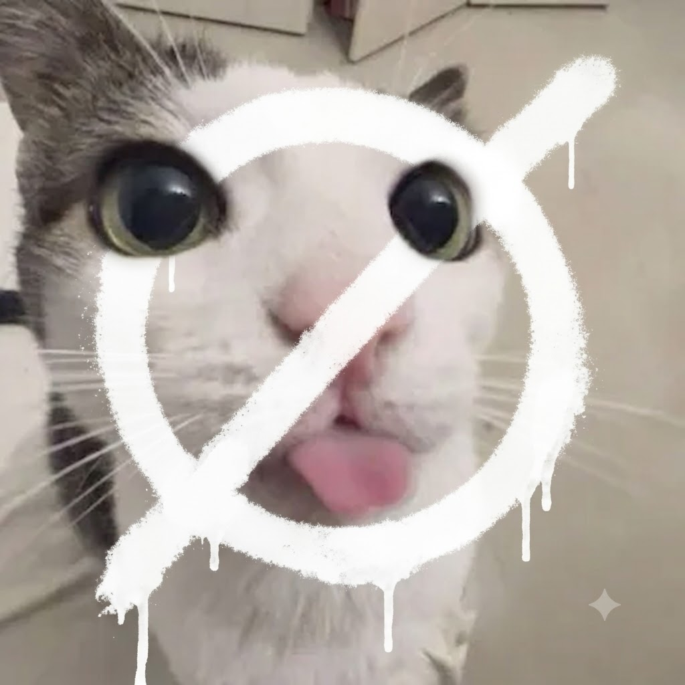

# SefPet — Desktop Pet

A desktop pet that lives on your screen. It wanders around the bottom of your
desktop, reacts to clicks, talks out loud, answers questions, gets hungry,
wants to play, and generally tries to be a good little creature.



## Features

- **Lives on your desktop** — frameless, transparent, always-on-top window
- **Wanders around** — walks left and right along the bottom of the screen, flips to face its direction
- **Drag it anywhere** — pick it up and drop it wherever you like
- **Talks** — speech bubbles with a typewriter effect *and* real text-to-speech (macOS `say`, Windows SAPI, Linux espeak — zero extra deps)
- **Answer questions** — ask it anything; it uses an AI brain when a key is configured, with a built-in offline brain otherwise
- **Mood system** — it gets hungry, tired, and happy over time, and tells you about it
- **Interactions** — click (boop!), double-click (headpats), right-click for a full menu
- **Mini-features** — jokes, facts, math, the time, coin flips, dice, rock-paper-scissors, singing, dancing (zoomies), feeding, sleeping
- **System tray** — hide it to the tray, feed it or quit from there
- **Settings** — name, voice pace, toggles for TTS / AI / walking / always-on-top; persisted to `~/.sefpet/config.json`
- **Custom sprite** — drop your own `desktoppet.png` / `desktoppet.jpg` next to the app
- **Cross-platform** — Windows (exe), macOS (app), Linux

## Quick start (from source)

```bash
python3 -m venv .venv && source .venv/bin/activate   # Windows: .venv\Scripts\activate
pip install -r requirements.txt
python pet.py
```

## AI brain

SefPet uses an OpenAI-compatible API when a key is present (falls back to the
offline brain if not). Configure via environment variables or a `.env` file in
the repo root / `~/.sefpet/.env`:

| Variable | Purpose |
| --- | --- |
| `SEFPET_AI_KEY` | API key (also accepts `GROQ_API_KEY`, `DEEPSEEK_API_KEY`, `INFERX_API_KEY`) |
| `SEFPET_AI_BASE_URL` | OpenAI-compatible base URL (defaults to Groq) |
| `SEFPET_AI_MODEL` | Model name (default `llama-3.3-70b-versatile`) |

No key? The offline brain still handles greetings, jokes, facts, math, time,
games, and a chatty personality.

## Building a standalone app

### macOS (builds `dist/SefPet.app` and zips it)

```bash
bash build_mac.sh
```

### Windows (builds `dist/SefPet.exe`)

```powershell
powershell -ExecutionPolicy Bypass -File build_windows.ps1
```

> macOS apps are unsigned — on first run, right-click the app and choose **Open** to bypass Gatekeeper.

## GitHub releases

Push a tag and CI builds + attaches the Windows exe and macOS app:

```bash
git tag v1.0.0
git push origin v1.0.0
```

The workflow lives at `.github/workflows/release.yml`.

## Controls

| Input | Action |
| --- | --- |
| Left-click | Boop / random reaction |
| Double-click | Headpat / wake up |
| Right-click | Menu (feed, pet, play, ask, jokes, facts, sleep, settings, quit…) |
| Drag | Move the pet anywhere |
| Tray icon | Show/hide, feed, quit |
